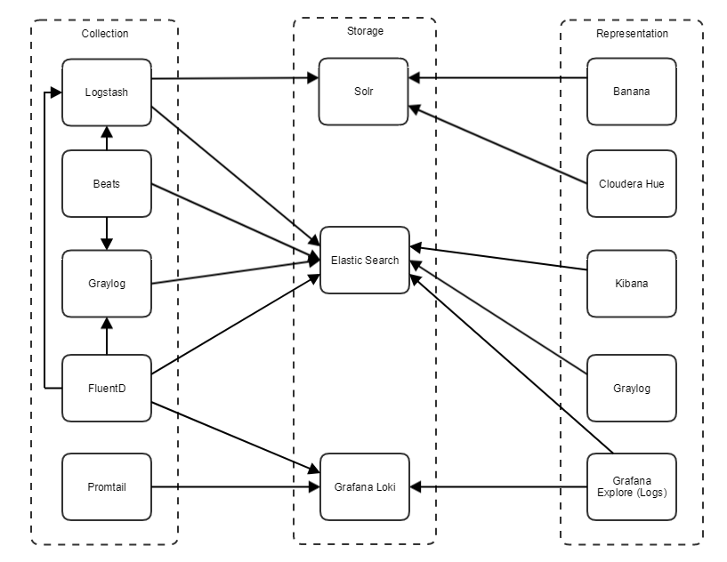

# Open Source Log Management Solutions

## Abstract

Currently there are multiple open-source tools intended for collection, storage and representation of text-based logs. In order to make knowledgeable long-term decisions on monitoring solutions, engineers need to understand differences in feature set, hardware requirements and level of support of those tools. 

It is also crucial to understand inter-dependencies between log processing components. In order to design fine-tailored log management system, engineers need to be familiar with existing open-source logging components, their capabilities and operational requirements.

The purpose of this research is to analyze differences between several well known Log Management solutions and present results in a structured way. Results of the investigation should help technical experts to pick an appropriate solution that meets specific requirements.

It should be noted that only free Log Management solutions and their free features were reviewed. Study contains relevant parts that describe differences between tools of similar function.

## Log Management Systems

Logs can be described as free-form comments, produced by the software during it's execution. In order to efficiently process and analyze them various open source tools have been created.

Log Management system is a combination of such tools, with core responsibilities mentioned below:

*   capture of logs from applications (belongs to "Collection" functionality)
*   storage of log data (belongs to "Storage" functionality)
*   search/analysis of log data (belongs to "Representation" functionality)

More detailed definition and use cases of Log Management Systems can be found in [Sematext Log Management guide](https://sematext.com/guides/log-management) and [Graylog Log Management guide](https://www.graylog.org/post/what-is-log-management-a-complete-logging-guide)

## Structure of the Research

In order to visualize inter-dependencies between logging components we've created a compatibility map. Components are organized according to their function: collection, storage and representation. 

Dependencies graph shows that the most important choice to make is the proper storage service. This will define what collection and representation tools could be reliably integrated into the system.

We define three component's stacks, clustered around storage services: Solr, Elasticsearch and Loki.

Review of the stacks is followed by a description of individual logging components, grouped by it's responsibility: collection, storage or representation.

For readers, who want to experiment with described services we've provided a set of Github-hosted playground projects (docker-compose definitions).

  

## Tools Compatibility Map

This section represents inter-dependencies between most popular open-source components of logging tools.

Tools are grouped by responsibility: collection, storage or representation.

Outbound arrow represents dependency or ability to be integrated with some component. Multiple outbound arrows represent alternatives that could be used building Log Management System.

For Instance, Fluentd can send collected logs to Elasticsearch, Grafana Loki or to Logstash for further processing and rerouting. 

Log Management System is expected to have one representation tool, one storage tool and at least one collection tool.

  

## Stacks Overview

Services that are responsible for logs collection and representation are usually dependent on specific logs storage. Therefore, it could be convenient to group them into solutions (stacks) differentiated by compatibility with certain logs storage:

1.  Solr stack
2.  Elastic stack
3.  Grafana Loki stack

### Solr Stack

Unfortunately opensource log representation solutions that are able to work with Solr have a set of critical drawbacks:

1.  Banana has a low activity (~20 commits during last two years) of contributors, which means that it could be troubling to get new features and bug fixes (see [github cotributors chart](https://github.com/lucidworks/banana/graphs/contributors)).
2.  Cloudera Hue is able to work with Solr only via it's sql interface, preventing users from utilizing full text search capabilities of the engine (see [Hue documentation](https://docs.gethue.com/user/querying/#apache-solr-sql))

Solr is quite close to Elastic in terms of feature set (for open-source versions) and performance (see [Mustafa, 2016](https://www.researchgate.net/publication/311916747_An_Analysis_on_the_Comparison_of_the_Performance_and_Configuration_Features_of_Big_Data_Tools_Solr_and_Elasticsearch)), as both are based on Lucene.

### Elastic Stack

Tooling in this stack is mostly represented by solutions from [Elastic](https://www.elastic.co/about/).

Solutions from Elastic are well maintained and cover most of the log sources (see [Beats](https://github.com/elastic/beats) and [Logstash](https://www.elastic.co/guide/en/logstash/current/input-plugins.html)).

Elasticsearch is a mature full-text search engine [widely adopted](https://db-engines.com/en/ranking) by the industry.

### Grafana Stack

Grafana Loki is a relatively new product - first beta was released [Jun 4, 2019](https://github.com/grafana/loki/releases/tag/v0.1.0). Version 1.0.0 seen the light [Nov 20, 2019](https://github.com/grafana/loki/releases)

Due to the novelty of the product there aren't lot of compatible logs collection tools. At the moment of writing (Dec 19, 2019) it's Fluentd and Promtail.

There is also a [Docker driver](https://github.com/grafana/loki/blob/master/docs/clients/docker-driver/configuration.md) that is capable of routing logs directly to Loki instance.

### Stacks Summary  

Unfortunately the lack of high-quality representation tools renders Solr stack unfit for modern production ready systems.

Grafana Stack is a new, promising player in the field of log-processing. It might be considered as a viable alternative to Elastic-based solutions.

## Storage Services Review  

This section contains descriptions of services that are responsible for storing/indexing logs. 

### Elasticsearch

Elasticsearch is a search engine based on the Lucene library. It provides a distributed, multitenant-capable full-text search engine with an HTTP web interface and schema-free JSON documents. Elasticsearch is developed in Java

*   [https://www.elastic.co/guide/index.html](https://www.elastic.co/guide/index.html)
*   [https://github.com/elastic/elasticsearch](https://github.com/elastic/elasticsearch)
*   [https://github.com/elastic/helm-charts/tree/master/elasticsearch](https://github.com/elastic/helm-charts/tree/master/elasticsearch)

### Solr

Solr is the fast open source search platform built on Apache Lucene™ that provides scalable indexing and search, as well as faceting, hit highlighting and advanced analysis/tokenization capabilities. Solr and Lucene are managed by the [Apache Software Foundation](http://www.apache.org/)

*   [http://lucene.apache.org/solr/guide/](http://lucene.apache.org/solr/guide/)
*   [https://github.com/apache/lucene-solr](https://github.com/apache/lucene-solr)
*   [https://github.com/helm/charts/tree/master/incubator/solr](https://github.com/helm/charts/tree/master/incubator/solr)

### Grafana Loki

Loki is a horizontally-scalable, highly-available, multi-tenant log aggregation system inspired by [Prometheus](https://prometheus.io/). It is designed to be very cost effective and easy to operate. It does not index the contents of the logs, but rather a set of labels for each log stream.

Compared to other log aggregation systems, Loki:

*   does not do full text indexing on logs. By storing compressed, unstructured logs and only indexing metadata, Loki is simpler to operate and cheaper to run.
*   indexes and groups log streams using the same labels you’re already using with Prometheus, enabling you to seamlessly switch between metrics and logs using the same labels that you’re already using with Prometheus.
*   is an especially good fit for storing [Kubernetes](https://kubernetes.io/) Pod logs. Metadata such as Pod labels is automatically scraped and indexed.
*   has native support in Grafana (needs Grafana v6.0).

*   [https://github.com/grafana/loki/blob/master/README.md](https://github.com/grafana/loki/blob/master/README.md)
*   [https://github.com/grafana/loki/tree/master/docs](https://github.com/grafana/loki/tree/master/docs)
*   [https://github.com/grafana/loki/tree/master/production/helm](https://github.com/grafana/loki/tree/master/production/helm)

### Core Differences

|                         | Elasticsearch                        | Solr                                 | Grafana Loki                                                                                                                                                  |
| ----------------------- | ------------------------------------ | ------------------------------------ | ------------------------------------------------------------------------------------------------------------------------------------------------------------- |
| Search Engine           | [Lucene](https://lucene.apache.org/) | [Lucene](https://lucene.apache.org/) | [Loki](https://github.com/grafana/loki/blob/master/docs/overview/README.md)                                                                                   |
| Orchestration           | \-                                   | Zookeeper                            | Consul                                                                                                                                                        |
| Storage (Cluster Setup) | File System                          | File System                          | Index Storage: Amazon DynamoDB, Google BigTable, Apache Cassandra   Blob Storage: Amazon DynamoDB, Google BigTable, Apache Cassandra, S3, Google Cloud Storage |

## Collection Services Review

This section contains descriptions of services that are responsible for collecting, parsing and re-routing logs to logs storage. 

### Logstash

Logstash is part of the [Elastic Stack](https://www.elastic.co/products) along with Beats, Elasticsearch and Kibana. Logstash is a server-side data processing service that ingests data from a multitude of sources , transforms it, and then sends it one of the many destinations.

Logstash has over 200+ plugins.

*   [https://www.elastic.co/guide/en/logstash/master/index.html](https://www.elastic.co/guide/en/logstash/master/index.html)
*   [https://github.com/elastic/logstash](https://github.com/elastic/logstash)
*   [https://github.com/elastic/helm-charts/tree/master/logstash](https://github.com/elastic/helm-charts/tree/master/logstash) 
*   [https://www.elastic.co/guide/en/logstash/current/input-plugins.html](https://www.elastic.co/guide/en/logstash/current/input-plugins.html)

### Beats

The Beats are lightweight data shippers, written in Go, that can be installed on servers to capture all sorts of operational data (logs, metrics, or network packet data). The Beats send the operational data to Elasticsearch, either directly or via Logstash.

*   [https://github.com/elastic/beats](https://github.com/elastic/beats)
*   [https://www.elastic.co/guide/en/beats/libbeat/current/beats-reference.html](https://www.elastic.co/guide/en/beats/libbeat/current/beats-reference.html)
*   [https://github.com/elastic/helm-charts/tree/master/filebeat](https://github.com/elastic/helm-charts/tree/master/filebeat)

### Fluentd

Fluentd collects events from various data sources and writes them to files, RDBMS, NoSQL, IaaS, SaaS, Hadoop and so on. Fluentd helps you unify your logging infrastructure (Learn more about the [Unified Logging Layer](https://www.fluentd.org/blog/unified-logging-layer))

*   [https://docs.Fluentd.org](https://docs.fluentd.org)
*   [https://github.com/fluent/Fluentd](https://github.com/fluent/fluentd)
*   [https://www.Fluentd.org/datasources](https://www.fluentd.org/datasources) 
*   [https://docs.Fluentd.org/input](https://docs.fluentd.org/input)
*   [https://github.com/helm/charts/tree/master/stable/Fluentd](https://github.com/helm/charts/tree/master/stable/fluentd)

### Promtail

Promtail's mode of operation is to discover log files stored on disk and forward them associated with a set of labels to Loki. Promtail can do service discovery for Kubernetes pods running on the same node as Promtail, act as a container sidecar or a Docker logging driver, read logs from specified folders, and tail the systemd journal.

*   [https://github.com/grafana/loki/tree/master/docs/clients/promtail](https://github.com/grafana/loki/tree/master/docs/clients/promtail)
*   [https://github.com/grafana/loki/blob/master/docs/overview/comparisons.md](https://github.com/grafana/loki/blob/master/docs/overview/comparisons.md)
*   [https://github.com/grafana/loki/tree/master/production/helm/promtail](https://github.com/grafana/loki/tree/master/production/helm/promtail)

### Graylog

*   [http://docs.graylog.org/en/3.1/index.html](http://docs.graylog.org/en/3.1/index.html)
*   [https://github.com/Graylog2/graylog2-server](https://github.com/Graylog2/graylog2-server)
*   [https://github.com/helm/charts/tree/master/stable/graylog](https://github.com/helm/charts/tree/master/stable/graylog)

Sources of collected data:

*   Syslog (TCP/UDP)
*   GELF (send from app)
*   Kafka as transport queue
*   RabbitMQ
*   Reading from files: Graylog Sidecar [https://docs.graylog.org/en/3.1/pages/sidecar.html#graylog-sidecar](https://docs.graylog.org/en/3.1/pages/sidecar.html#graylog-sidecar)
*   and other cases [https://docs.graylog.org/en/3.1/pages/sending\_data.html](https://docs.graylog.org/en/3.1/pages/sending_data.html)

There is also evidence of using Fluentd as a source for Graylog (e.g., [https://blog.insiderattack.net/bunyan-json-logs-with-Fluentd-and-graylog-187a23b49540](https://blog.insiderattack.net/bunyan-json-logs-with-fluentd-and-graylog-187a23b49540), [https://www.devinitiate.com/managing-logs-with-graylog-Fluentd/](https://www.devinitiate.com/managing-logs-with-graylog-fluentd/))

Finally, you can find binding of Fluentd and GELF Plugin (inspired by [https://blog.insiderattack.net/bunyan-json-logs-with-Fluentd-and-graylog-187a23b49540](https://blog.insiderattack.net/bunyan-json-logs-with-fluentd-and-graylog-187a23b49540)):

*   [https://github.com/emsearcy/fluent-plugin-gelf](https://github.com/emsearcy/fluent-plugin-gelf)
*   [https://github.com/deepal/fluent-plugin-gelf](https://github.com/deepal/fluent-plugin-gelf)

### Core Differences

Below is a comparison of various open-source logs collectors. according to resource requirements, supported sources and downstream destinations.

|                       | Logstash                                                                                     | Beats                                                                                        | Graylog                                                                                     | Fluentd                                                                                     | Promtail                                                                                     |
| --------------------- | -------------------------------------------------------------------------------------------- | -------------------------------------------------------------------------------------------- | ------------------------------------------------------------------------------------------- | ------------------------------------------------------------------------------------------- | -------------------------------------------------------------------------------------------- |
| Platform              | Java                                                                                         | Go                                                                                           | Java                                                                                        | Ruby                                                                                        | Go                                                                                           |
| Memory Consumption    | high                                                                                         | low                                                                                          | high                                                                                        | medium                                                                                      | low                                                                                          |
| Alerting              |  |  |  |  |  |
| Multiple Destinations |   |  |  |  |  |

### Log Sources Compatibility Map

Most common sources of logs, grouped by producers:

1.  Applications
    1.  Files
    2.  Events over TCP
    3.  Windows Eventlog
2.  Linux OS packages/utilities
    1.  [Syslog over network](https://en.wikipedia.org/wiki/Syslog#Network_protocol)
    2.  [Journald](https://manpages.debian.org/stretch/systemd/systemd-journald.service.8.en.html)
3.  Windows OS packages/utilities
    1.  Windows Eventlog
4.  Streams
    1.  AMQP
    2.  Kafka

| Log Sources                  | [Logstash](https://www.elastic.co/guide/en/logstash/current/input-plugins.html)              | [Beats\*](https://github.com/elastic/beats)                                                  | [Graylog](https://docs.graylog.org/en/3.1/pages/sidecar.html)                                | [Fluentd](https://docs.fluentd.org/input)                                                    | [Promtail](https://github.com/grafana/loki/blob/master/docs/clients/promtail/scraping.md)    |
| ---------------------------- | -------------------------------------------------------------------------------------------- | -------------------------------------------------------------------------------------------- | -------------------------------------------------------------------------------------------- | -------------------------------------------------------------------------------------------- | -------------------------------------------------------------------------------------------- |
| Files                        |   |   |   |   |   |
| Unstructured events over TCP |   |  |   |   |  |
| GELF over network            |   |  |   |  |  |
| Syslog over network          |   |  |   |   |   |
| Journald                     |   |   |  |  |   |
| Windows Eventlog             |  |   |   |   |  |
| Kafka                        |   |  |   |   |  |
| AMQP                         |   |  |   |  |  |

\* - Beats is a set of tools, rather then a single application

## Representation Services Review  

This section shows a comparison of various user-facing solutions used as an interface for searching and visualizing logs.

Solutions are compared according to these aspects: search syntax, visualization features, alerting and user management capabilities. 

### Kibana

Kibana is an open source frontend application that sits on top of the Elastic Stack, providing search and data visualization capabilities for data indexed in Elasticsearch. Commonly known as the charting tool for the Elastic Stack (previously referred to as the ELK Stack after Elasticsearch, Logstash, and Kibana), Kibana also acts as the user interface for monitoring, managing, and securing an Elastic Stack cluster — as well as the centralized hub for built-in solutions developed on the Elastic Stack.

*   [https://github.com/elastic/kibana](https://github.com/elastic/kibana)

### Grafana Explore (Logs)

Grafana Explore allows you to dig deeper into your metrics and logs to find the cause.

Grafana's new logging data source, Loki is tightly integrated into Explore and allows you to correlate metrics and logs by viewing them side-by-side.

*   [https://grafana.com/docs/features/explore/](https://grafana.com/docs/features/explore/)
*   [https://github.com/grafana/grafana](https://github.com/grafana/grafana)

### Graylog

Detailed description of the Graylog representation aspect can be found by the links:

*   [https://docs.graylog.org/en/3.1/pages/queries.html](https://docs.graylog.org/en/3.1/pages/queries.html)
*   [https://docs.graylog.org/en/3.1/pages/dashboards.html](https://docs.graylog.org/en/3.1/pages/dashboards.html)

### General Features

|                                   | Kibana                                                                                                                                                                                   | Graylog                                                                                                                                                         | Grafana - Loki                                                                                                                    |
| --------------------------------- | ---------------------------------------------------------------------------------------------------------------------------------------------------------------------------------------- | --------------------------------------------------------------------------------------------------------------------------------------------------------------- | --------------------------------------------------------------------------------------------------------------------------------- |
| Query Language                    | <ul><li>Kibana Query Language (close to Lucene syntax)</li><li>Lucene</li></ul> | Close to Lucene syntax                                                                                                                                          | [LogQL](https://github.com/grafana/loki/blob/master/docs/logql.md)                                                                |
| Fuzzy Search                      |  (Levenshtein distance)                                  |  (Damerau–Levenshtein distance) |  |
| Regex Search                      |                                                          |                                 |   |
| Text Normalization                |                                                          |                                 |  |
| Transform message at display time |                                                         |  (Decorators)                   |  |
| Dashboards                        |                                                          |                                 |   |
| Alerts                            |  ([Yelp/elastalert](https://github.com/Yelp/elastalert)) |                                 |  |

### AuthN/AuthZ

|                         | Kibana*                                                                                                                            | Graylog                                                                                                                           | Grafana - Loki                                                                                                                   |
| ----------------------- | --------------------------------------------------------------------------------------------------------------------------------- | --------------------------------------------------------------------------------------------------------------------------------- | -------------------------------------------------------------------------------------------------------------------------------- |
| OAuth2                  |  |  |  |
| AD groups               |  |   |  |
| AD users                |  |   |  |

\* - setup without paid [X-Pack extension](https://www.elastic.co/guide/en/x-pack/current/xpack-introduction.html) 

### Additional Representation Services

This section lists services that provide limited feature set or have weak community support (based on github activity). 

### Grafana Log CLI

LogCLI allows users to run LogQL queries against a Loki server.

*   [https://github.com/grafana/loki/blob/master/docs/getting-started/logcli.md](https://github.com/grafana/loki/blob/master/docs/getting-started/logcli.md)

### Banana

The Banana project was forked from [Kibana](https://github.com/elastic/kibana), and works with all kinds of time series (and non-time series) data stored in [Apache Solr](https://lucene.apache.org/solr/).

*   [https://github.com/lucidworks/banana](https://github.com/lucidworks/banana)

### Cloudera Hue

Hue is a web-based interactive query editor that enables you to interact with data warehouses.

*   [https://docs.gethue.com/](https://docs.gethue.com/)
*   [https://github.com/cloudera/hue](https://github.com/cloudera/hue)

## Summary

Various open-source log management component were reviewed. This work provides structured description of their responsibilities, features and (inter-)dependencies.

Research is based on analysis of products' documentation. This work provides links to official vendors' web-sites and github, whenever it was necessary to support highlighted components' features.

We hope that this work will help engineers to make educated decisions on Log Management System architecture, build efficient, versatile monitoring infrastructures. 

## References

\[Mustafa, 2016\] AKCA, Mustafa & Aydoğan, Tuncay & Ilkuçar, Muhammer. (2016). An Analysis on the Comparison of the Performance and Configuration Features of Big Data Tools Solr and Elasticsearch. International Journal of Intelligent Systems and Applications in Engineering. 4. 8-8. 10.18201/ijisae.271328.
  
## Authors
* Vitaliy Levashin
* Mihail Klyuykov
* Yuriy Chizhov